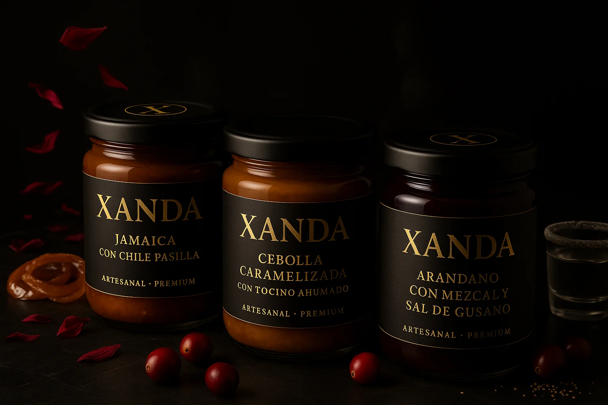
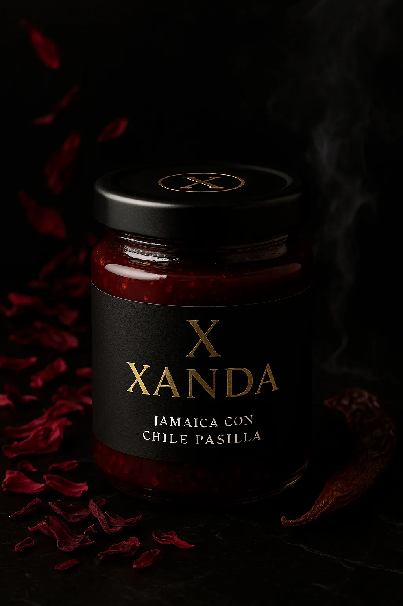
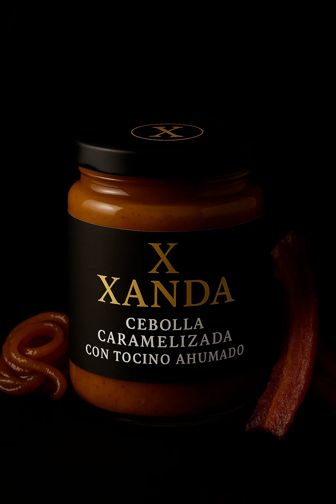
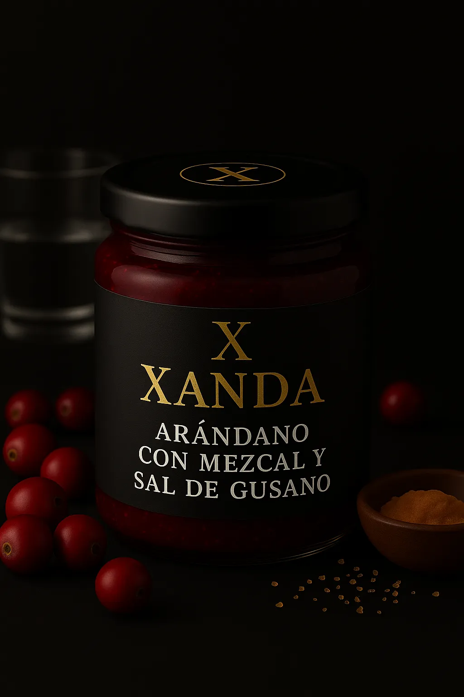
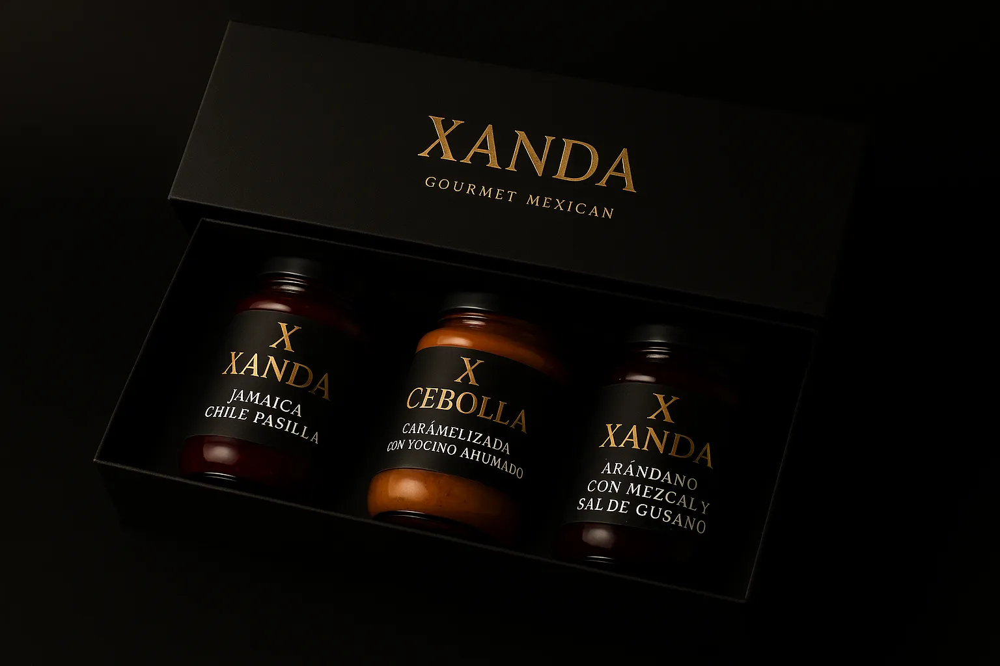

# INSTRUCTIONS.md — Xanda Landing (GitHub Pages + Stripe Buy Button)

These are **integrated, copy‑paste ready instructions** for Claude Code to build and ship the **Xanda** landing page as a static site on **GitHub Pages** with a working **cart** using **Stripe Buy Button** (no backend). The goal is **fast, reliable deployment** with high visual polish.

---

## 0) Objectives & Acceptance Criteria

**Objectives**
- Deliver a premium, minimal landing for **Xanda** (black matte + gold, editorial look).
- Enable purchases with a **cart** using **Stripe Buy Button** (multiple products, adjustable quantities).
- Deploy on **GitHub Pages** with a custom domain (optional).

**Acceptance Criteria**
- Page renders identically on **mobile**, **tablet**, and **desktop**.
- 3 products + 1 gift box available for purchase via embedded **Stripe Buy Buttons**.
- Stripe **cart** opens and allows adding multiple products and quantities.
- Core Web Vitals pass: Lighthouse Performance ≥ 90, Accessibility ≥ 90.
- SEO metadata present (title, meta description, social previews).
- Repo includes clear **README** and **LICENSE** (MIT suggested).
- Build is 100% static (no secret keys in code).

---

## 1) Tech Choices

- **Static** site (no framework): HTML + Tailwind CDN + minimal CSS.
- **Stripe Buy Button**: embeds via `<stripe-buy-button>` components; cart behavior handled by Stripe.
- **Images**: WebP preferred; fallback to high‑quality JPG.
- **Deployment**: GitHub Pages.

---

## 2) Project Structure

```
/ (repo root)
├─ index.html
├─ styles.css
├─ README.md
├─ INSTRUCTIONS.md  ← this file
└─ assets/
   ├─ logo.svg
   ├─ hero.webp      (or .jpg)
   ├─ jamaica.webp
   ├─ cebolla.webp
   ├─ arandano.webp
   └─ giftbox.webp
```

---

## 3) Stripe Setup (Dashboard)

1. Create **Products**:
   - *Jamaica con chile pasilla* — one‑time price (MXN)
   - *Cebolla caramelizada con tocino ahumado* — one‑time price (MXN)
   - *Arándano con mezcal y sal de gusano* — one‑time price (MXN)
   - *Gift Box 3 frascos* — one‑time price (MXN)

2. Create **Buy Buttons** (one per product):
   - Enable **Allow quantity to be adjusted**
   - Enable **Collect shipping address**
   - (Optional) Enable **Promo codes**

3. Copy each **`buy-button-id`** and the **Publishable key** (`pk_live_*` or `pk_test_*`).  
   > Do **not** expose the Secret key in a static site.

---

## 4) Implementation — `index.html`

> Replace the placeholder IDs (`BUY_BTN_*`) and `PUBLISHABLE_KEY_*` with real values from Stripe.

```html
<!DOCTYPE html>
<html lang="es">
<head>
  <meta charset="utf-8">
  <meta name="viewport" content="width=device-width, initial-scale=1">
  <title>Xanda — Sabores que trascienden</title>
  <meta name="description" content="Xanda: mermeladas y salsas gourmet mexicanas. Ingredientes reales, técnica artesanal y lujo discreto.">
  <meta property="og:title" content="Xanda — Sabores que trascienden">
  <meta property="og:description" content="Mermeladas y salsas gourmet mexicanas.">
  <meta property="og:image" content="assets/hero.webp">
  <meta name="theme-color" content="#0a0a0a">

  <link rel="preconnect" href="https://fonts.googleapis.com">
  <link rel="preconnect" href="https://fonts.gstatic.com" crossorigin>
  <link href="https://fonts.googleapis.com/css2?family=Playfair+Display:wght@500;700&family=Inter:wght@300;400;600&display=swap" rel="stylesheet">
  <script src="https://cdn.tailwindcss.com"></script>
  <link rel="stylesheet" href="./styles.css">

  <!-- Stripe Buy Button -->
  <script async src="https://js.stripe.com/v3/buy-button.js"></script>
</head>
<body class="bg-neutral-950 text-neutral-100 selection:bg-amber-300 selection:text-neutral-900">
  <!-- Navbar -->
  <header class="sticky top-0 z-40 bg-neutral-950/80 backdrop-blur border-b border-neutral-800">
    <div class="max-w-6xl mx-auto px-4 py-3 flex items-center justify-between">
      <div class="flex items-center gap-3">
        
        <span class="sr-only">Xanda</span>
      </div>
      <nav class="hidden md:flex gap-6 text-sm text-neutral-300">
        <a href="#sabores" class="hover:text-white">Sabores</a>
        <a href="#regalos" class="hover:text-white">Edición regalo</a>
        <a href="#origen" class="hover:text-white">Origen</a>
        <a href="#contacto" class="hover:text-white">Contacto</a>
      </nav>
      <a href="#comprar" class="rounded-xl border border-amber-400/30 bg-neutral-900 px-4 py-2 text-amber-300 hover:bg-neutral-800 transition">Comprar ahora</a>
    </div>
  </header>

  <!-- Hero -->
  <section class="relative">
    <div class="max-w-6xl mx-auto grid md:grid-cols-2 gap-10 px-4 py-16 md:py-24 items-center">
      <div>
        <h1 class="font-['Playfair_Display'] text-4xl md:text-6xl leading-tight"><span class="text-amber-300">Xanda</span> — Sabores que trascienden</h1>
        <p class="mt-5 text-neutral-300 max-w-lg">Mermeladas y salsas gourmet mexicanas. Ingredientes reales, técnica artesanal, lujo discreto.</p>
        <div class="mt-8 flex gap-3">
          <a href="#sabores" class="btn-primary">Descubrir sabores</a>
          <a href="#comprar" class="btn-secondary">Comprar ahora</a>
        </div>
        <ul class="mt-6 text-sm text-neutral-400 list-disc list-inside space-y-1">
          <li>Hecho a mano en México</li>
          <li>Maridajes: quesos, carnes y coctelería</li>
          <li>Edición de regalo</li>
        </ul>
      </div>
      <div class="relative">
        <div class="hero-card">
          
          <div class="absolute inset-0 rounded-2xl bg-gradient-to-tr from-black/50 via-transparent to-transparent"></div>
        </div>
      </div>
    </div>
  </section>

  <!-- Sabores -->
  <section id="sabores" class="border-t border-neutral-800">
    <div class="max-w-6xl mx-auto px-4 py-16">
      <h2 class="font-['Playfair_Display'] text-3xl md:text-4xl mb-8">Colección de sabores</h2>

      <div class="grid md:grid-cols-3 gap-8">
        <!-- Jamaica -->
        <article class="card">
          <div class="aspect-[4/5] bg-neutral-900 rounded-xl flex items-center justify-center ring-1 ring-neutral-800">
            
          </div>
          <div class="p-4 space-y-3">
            <h3 class="text-xl font-semibold">Jamaica con chile pasilla</h3>
            <p class="text-sm text-neutral-400">Flores de jamaica con el calor elegante del pasilla. Quesos y postres.</p>
            <stripe-buy-button
              buy-button-id="BUY_BTN_JAMAICA"
              publishable-key="PUBLISHABLE_KEY_XANDA">
            </stripe-buy-button>
          </div>
        </article>

        <!-- Cebolla -->
        <article class="card">
          <div class="aspect-[4/5] bg-neutral-900 rounded-xl flex items-center justify-center ring-1 ring-neutral-800">
            
          </div>
          <div class="p-4 space-y-3">
            <h3 class="text-xl font-semibold">Cebolla caramelizada con tocino ahumado</h3>
            <p class="text-sm text-neutral-400">Clásico reinventado para hamburguesas, carnes y tablas.</p>
            <stripe-buy-button
              buy-button-id="BUY_BTN_CEBOLLA"
              publishable-key="PUBLISHABLE_KEY_XANDA">
            </stripe-buy-button>
          </div>
        </article>

        <!-- Arándano -->
        <article class="card">
          <div class="aspect-[4/5] bg-neutral-900 rounded-xl flex items-center justify-center ring-1 ring-neutral-800">
            
          </div>
          <div class="p-4 space-y-3">
            <h3 class="text-xl font-semibold">Arándano con mezcal y sal de gusano</h3>
            <p class="text-sm text-neutral-400">Ácido-terroso con final mineral; coctelería y carnes.</p>
            <stripe-buy-button
              buy-button-id="BUY_BTN_ARANDANO"
              publishable-key="PUBLISHABLE_KEY_XANDA">
            </stripe-buy-button>
          </div>
        </article>
      </div>
    </div>
  </section>

  <!-- Edición regalo -->
  <section id="regalos" class="border-t border-neutral-800 bg-neutral-900/30">
    <div class="max-w-6xl mx-auto px-4 py-16 grid md:grid-cols-2 gap-10 items-center">
      <div>
        <h2 class="font-['Playfair_Display'] text-3xl md:text-4xl">Edición regalo</h2>
        <p class="mt-3 text-neutral-300">Estuche rígido negro con 3 frascos. La forma más elegante de regalar México.</p>
        <ul class="mt-4 text-sm text-neutral-400 list-disc list-inside space-y-1">
          <li>Caja negra con logo en relieve</li>
          <li>Selecciona 3 sabores</li>
          <li>Tarjeta personalizada</li>
        </ul>
        <div class="mt-6">
          <stripe-buy-button
            buy-button-id="BUY_BTN_GIFTBOX"
            publishable-key="PUBLISHABLE_KEY_XANDA">
          </stripe-buy-button>
        </div>
      </div>
      <div class="aspect-[4/3] bg-neutral-900 rounded-2xl ring-1 ring-neutral-800 flex items-center justify-center">
        
      </div>
    </div>
  </section>

  <!-- Origen -->
  <section id="origen" class="border-t border-neutral-800">
    <div class="max-w-6xl mx-auto px-4 py-16 grid md:grid-cols-2 gap-10 items-start">
      <div>
        <h2 class="font-['Playfair_Display'] text-3xl md:text-4xl">Hecho a mano en México</h2>
        <p class="mt-3 text-neutral-300">Ingredientes selectos, lotes pequeños y técnica de confitado precisa.</p>
        <p class="mt-2 text-neutral-400">Trabajamos con productores locales y priorizamos prácticas sostenibles.</p>
      </div>
      <div class="space-y-3">
        <div class="fact">Vidrio grueso y tapa negra mate grabada</div>
        <div class="fact">Etiquetas negras con estampado dorado</div>
        <div class="fact">Maridajes: quesos, carnes, coctelería</div>
      </div>
    </div>
  </section>

  <!-- CTA final -->
  <section id="comprar" class="border-y border-neutral-800 bg-neutral-900/30">
    <div class="max-w-6xl mx-auto px-4 py-16 text-center">
      <h2 class="font-['Playfair_Display'] text-3xl md:text-4xl">Listo para probar Xanda</h2>
      <p class="mt-3 text-neutral-300">Elige tu sabor favorito o arma una caja de regalo.</p>
      <div class="mt-6 flex justify-center">
        <a href="#sabores" class="btn-primary">Ver sabores</a>
      </div>
    </div>
  </section>

  <!-- Footer -->
  <footer id="contacto" class="text-sm text-neutral-400">
    <div class="max-w-6xl mx-auto px-4 py-10 grid md:grid-cols-3 gap-6">
      <div>
        
        <p>© <span id="year"></span> Xanda. Todos los derechos reservados.</p>
      </div>
      <div>
        <p class="font-semibold text-neutral-300">Enlaces</p>
        <ul class="mt-2 space-y-1">
          <li><a href="#sabores" class="hover:text-white">Sabores</a></li>
          <li><a href="#regalos" class="hover:text-white">Edición regalo</a></li>
          <li><a href="#origen" class="hover:text-white">Origen</a></li>
        </ul>
      </div>
      <div>
        <p class="font-semibold text-neutral-300">Contacto</p>
        <p class="mt-2">hola@xanda.mx</p>
        <div class="mt-3 flex gap-3">
          <a href="#" class="hover:text-white">Instagram</a>
          <a href="#" class="hover:text-white">TikTok</a>
          <a href="#" class="hover:text-white">Pinterest</a>
        </div>
      </div>
    </div>
  </footer>

  <script>document.getElementById('year').textContent = new Date().getFullYear();</script>
</body>
</html>
```

---

## 5) Styles — `styles.css`

```css
:root { --gold: #CFAE63; }
.btn-primary { border-radius: 0.75rem; padding: 0.75rem 1.25rem; background: #FCD34D; color: #0a0a0a; font-weight: 600; }
.btn-primary:hover { background:#FDE68A; }
.btn-secondary { border-radius: 0.75rem; padding: 0.75rem 1.25rem; border:1px solid #262626; color:#e5e5e5; }
.btn-secondary:hover { background:#171717; }
.card { background:#0a0a0a; border:1px solid #262626; border-radius:1rem; overflow:hidden; }
.product-img { width:100%; height:100%; object-fit:cover; }
.fact { background:#0f0f0f; border:1px solid #262626; border-radius:0.75rem; padding:0.75rem 1rem; }
.hero-card { box-shadow: 0 30px 80px rgba(0,0,0,.5); }
```

---

## 6) GitHub Pages Deployment

1. Create a **public repo** and push files.
2. GitHub → **Settings → Pages** → Source: `main` / Root (`/`).
3. Wait for Pages to publish, note the URL.
4. (Optional) Custom domain: add **CNAME** in Pages; point DNS to GitHub with A/AAAA and CNAME records.

---

## 7) Stripe Cart Behavior & Testing

- Cart opens when there are **multiple** `<stripe-buy-button>` components on the page.
- Test mode: use card `4242 4242 4242 4242` with any future date, CVC, and ZIP.
- Enable **Shipping** and **Stripe Tax** in Dashboard as needed.

---

## 8) Optimization Checklist

- [ ] Replace placeholder images with compressed **WebP** (≤ 200KB hero, ≤ 120KB product).
- [ ] Add `alt` text for all images (already included).
- [ ] Validate Lighthouse (Performance ≥ 90, Accessibility ≥ 90).
- [ ] Ensure buy-buttons use **consistent mode** (test vs live).
- [ ] Update social preview image (`og:image`) and favicon if available.

---

## 9) Future Enhancements (optional)

- Move to **Next.js** and a custom cart using **Checkout Sessions**.
- Add analytics (GA4/Meta), newsletter capture, and blog/recipes.
- Internationalization (ES/EN), geolocated prices, inventory indicators.

---

## 10) Variables to Replace (single source of truth)

- `BUY_BTN_JAMAICA` → Stripe Buy Button ID (Jamaica)
- `BUY_BTN_CEBOLLA` → Stripe Buy Button ID (Cebolla)
- `BUY_BTN_ARANDANO` → Stripe Buy Button ID (Arándano)
- `BUY_BTN_GIFTBOX` → Stripe Buy Button ID (Gift Box)
- `PUBLISHABLE_KEY_XANDA` → Stripe publishable key (test or live)

---

**Done.** With this file, Claude Code can implement, wire Stripe, and deploy Xanda in one pass.
